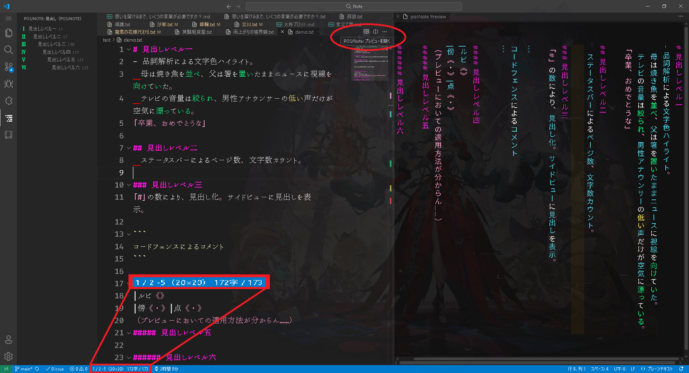

# 日本語 品詞カラー表示＋ページカウンタ

**日本語テキスト向け**の VS Code 拡張です。（最新版: v1.3.0）

- **品詞カラー表示**：`kuromoji` による形態素解析で、品詞ごとに**文字色**を付与
- **ページカウンタ**：原稿用紙風（行×列）で折り返し、**禁則処理**（行頭禁則）に対応
- **選択文字数表示**：選択範囲があればその文字数を表示、なければ全体文字数を表示
- **特殊記号・括弧ハイライト**：括弧内の文章や「—」「、」「。」などを指定色で強調
- **全角スペース表示**：全角スペース（　）に下線を付与（semantic token 方式）
- **Markdown に対応**：`.md` ファイルも解析対象
- **NOVEL-WRITER 連携**：言語モードが `Novel` の場合も対象
- **合算文字数表示（v1.2.0）**：同じフォルダ内の同じ拡張子の合算文字数を保存時に計算、ステータスバ表示（オプションでON/OFF可能）

---

## デモ



例：小説テキストに品詞ごとの色付け・括弧と記号の強調・ページ数と文字数カウントを表示

---

## 機能

- **品詞カラー表示（semantic token）**
  - `名詞/動詞/形容詞/副詞/助詞/助動詞/連体詞/接続詞/感動詞/接頭詞/その他`
  - 設定で任意のカラーコード／`inherit` を指定可能

- **特殊記号・括弧ハイライト**
  - 括弧とその中身を `bracket` として semantic token で強調（**改行をまたいでも**開き→次の対応閉じまで一括で色付け／ネスト対応）
  - 「—」「、」「。」などの記号も同様に色付け可能

- **ページカウンタ**
  - `rowsPerPage × colsPerRow`（例：40×40）で折り返し
  - 行頭禁則処理に対応
  - ステータスバーに `現在ページ/総ページ-行（行×列）字（編集中のファイルと同一フォルダ内、同一拡張子の総文字数）` を表示

- **選択文字数**
  - 選択があるときはその範囲の文字数を表示
  - 改行（LF）は文字数に含めない

- **全角スペース表示**
  - semantic token により下線を付与（色指定可）
  - 背景色ではなく下線方式のため、テーマとの相性が良い

- **合算文字数表示（v1.2.0）**
  - 同じフォルダ内にある `.txt` または `.md` の合算文字数を保存時に計算し、ステータスバーに括弧付きで表示（オプションでON/OFF可能）

- **全角括弧の入力支援（v1.2.1）**
  - 「『（［｛〈《【〔 などの**開き入力で自動的に閉じを補完**（常時ON）
  - **ネスト対応**：内側でさらに開きを入力しても、外側の閉じは押し出されて保持（例: `「『』」`）
  - **IME変換追従**：開きの確定後に「→『」へ変換すると、直後の閉じも自動で `」→』` に追従
  - **Backspace 連動**：開きを削除した際、直後が対応する閉じなら**自動で同時削除**
- **見出し折りたたみ制御（v1.3.0）**
  - 「#」で第一見出し、「##」で第二見出し（マークダウン記法と同様）
  - `Ctrl + [` による展開/折りたたみ
  - 一つでも見出しが展開され、変更されていれば「全折りたたみ」に切り替え、それ以外では「全展開」を実行

---

## 設定例

```jsonc
{
  "editor.semanticTokenColorCustomizations": {
    "rules": {
      // 品詞ごとの例（任意で色コードを変更可能）
      "noun": "#4dd0e1",        // 名詞
      "verb": "#11ff84",        // 動詞
      "adjective": "#ffd900",   // 形容詞
      "adverb": "#f94446",      // 副詞
      "particle": "#f6f7f8",    // 助詞
      "auxiliary": "#a1887f",   // 助動詞
      "prenoun": "#e0a000",     // 連体詞
      "conjunction": "#ff14e0", // 接続詞
      "interjection": "#ff7043",// 感動詞
      "symbol": "#fd9bcc",      // 記号
      "other": "#9e9e9e",       // その他

      // 特殊トークン
      "bracket": "#fd9bcc",     // 括弧と括弧内文書
      "fwspace": {              // 全角スペース
        "underline": true,
        "foreground": "#ff0000"
      },
      // 見出しカラー
      "heading": "#ff14e0"
    }
  },
  // 行頭禁則文字明記（記載分はデフォルト）
  "posPage.kinsoku.bannedStart": [
    "」","）","『","』","》","】","。","、",
    "’","”","！","？","…","—","―",
    "ぁ","ぃ","ぅ","ぇ","ぉ","ゃ","ゅ","ょ","っ",
    "ー","々","ゞ","ゝ",
    "ァ","ィ","ゥ","ェ","ォ","ャ","ュ","ョ","ッ"
  ]
}

"posPage.semantic.enabled": true,    // .txt や Novel 言語モードの品詞ハイライトを有効化
"posPage.semantic.enabledMd": true   // .md の品詞ハイライトを有効化

```


## 推奨ワークフロー

- `.txt` `.md`を対象にした小説や論文の執筆

- 入力中はカーソル周囲のみ装飾を残し、カクつきを低減

- 仕上げ時に全装飾を適用して見直し


## 既知の制約

- 大規模ファイルでは解析負荷が高くなる可能性あり

- 禁則処理は一部の組み合わせに限定


## ライセンス

MIT
